## Blogging Application Build in Laravel Framework

**php artisan make:model Post -mcr** is used to create Post Model, PostController and Post migration
**php artisan make:model Comment -mcr** is used to create Comment Model, CommentController and Comment migration

**User composer require laravel/breeze --dev** command for insalling laravel-breeze package 

**Reason for using Laravel-Breeze
  - It provides a simple authentication system including login, registration, and session handling.
  -  It’s a perfect fit for CRUD-based projects like your blog.

###For populating Dummy Data we can use following command

**For Populating User and Post Data**
>php artisan db:seed   

**For User Data only**
>php artisan db:seed --class=UserSeeder

*Dummy Login details are*
email:  admin@gmail.com
Password: password

**For Post Data only**
>php artisan db:seed --class=PostSeeder

### Listing of All Post
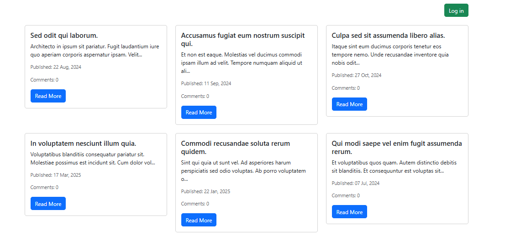

### View Post and Comment
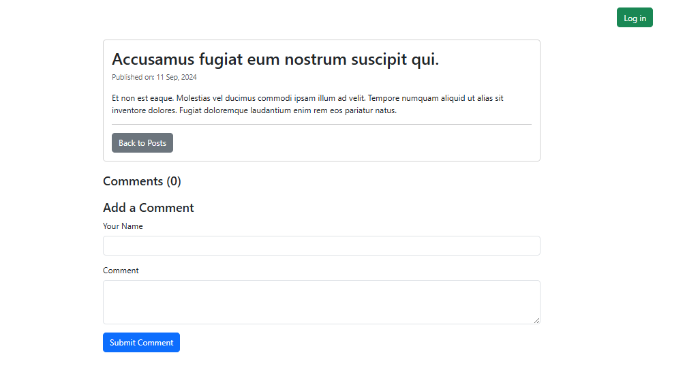

### View Post with Comment and comment count
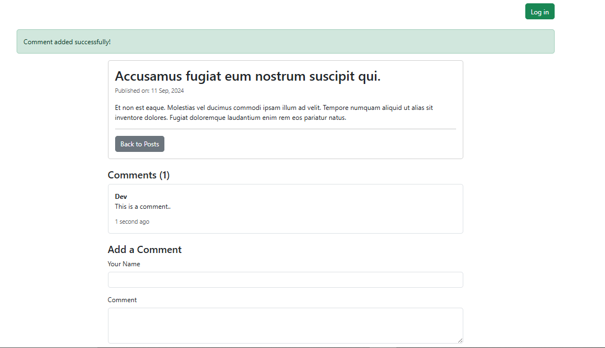

### Login Form
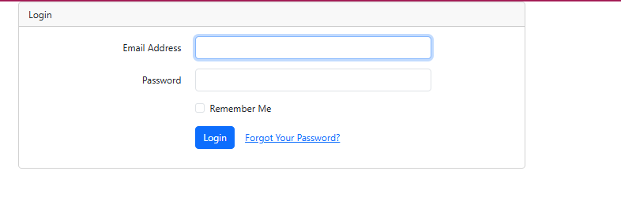

### Listing of Blog (After Successfully Login..)

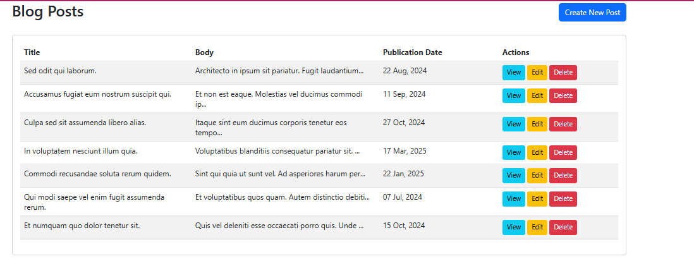

### Create Post Form
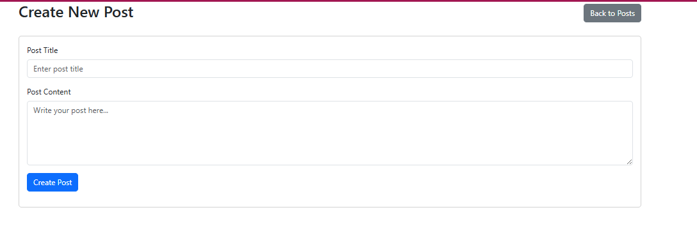

### Error Message on duplicate title (Form Validation)

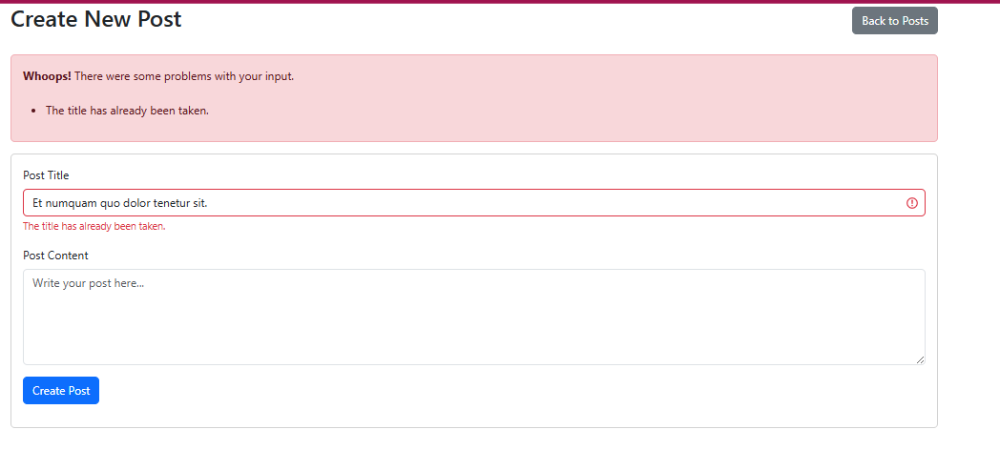

### Success Message on Post Create
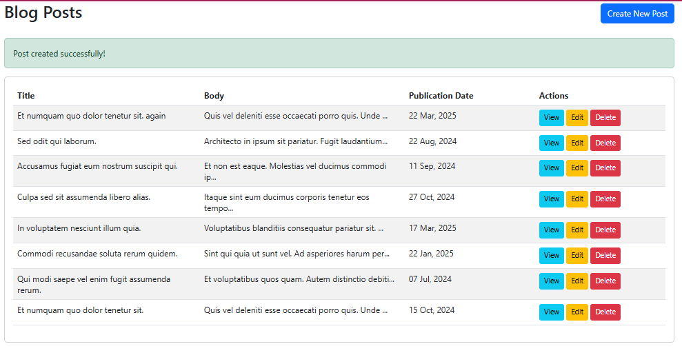

### View page for particular post
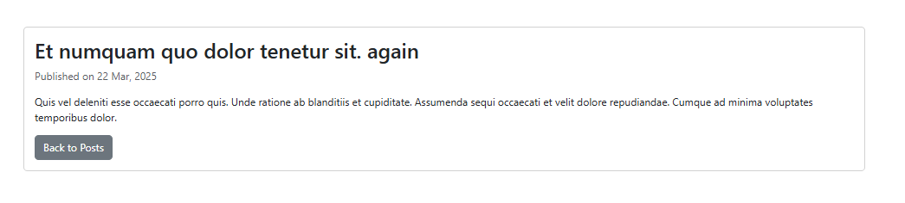

### Edit Page
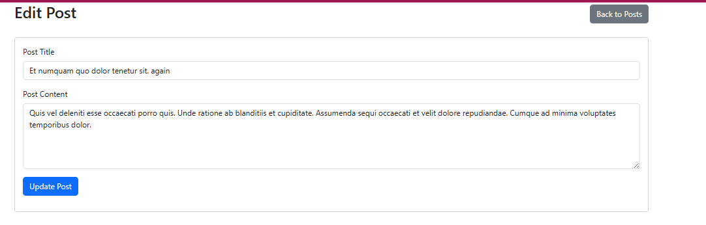

### Error Handling on duplicate Title in Edit form
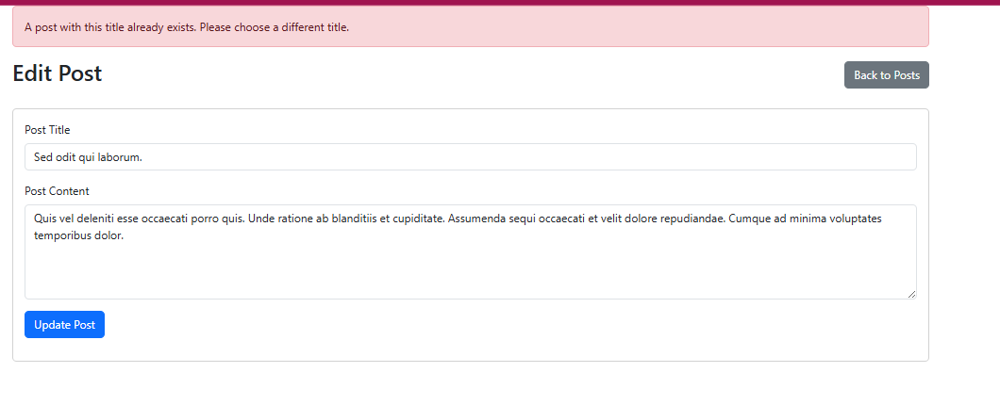

### Pop Up(Alert Box) on delete button click 

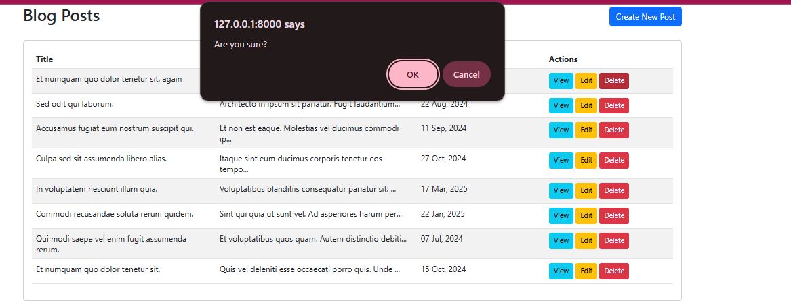

> I used soft deletes so that the data will not actually be deleted from the database..

**Designed and Developed By**
*Kapil Dev*
[kapil.d687@gmail.com]
